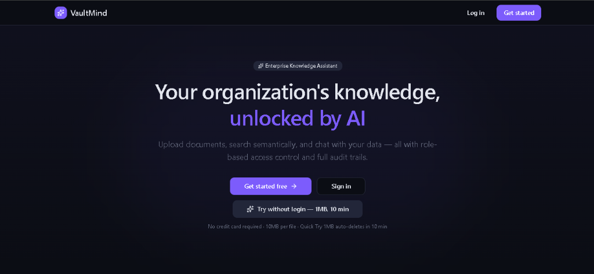
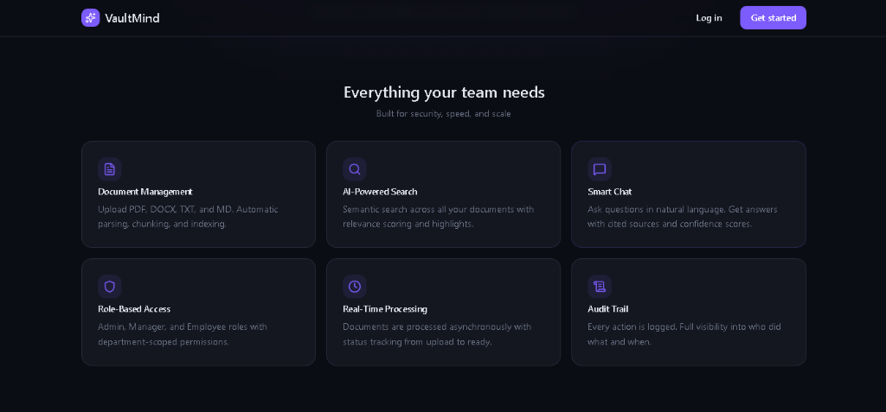
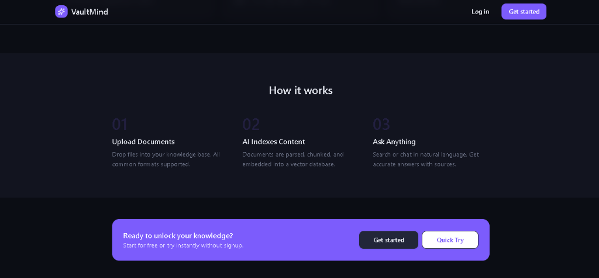
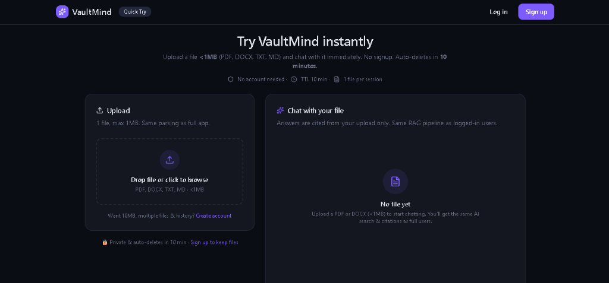
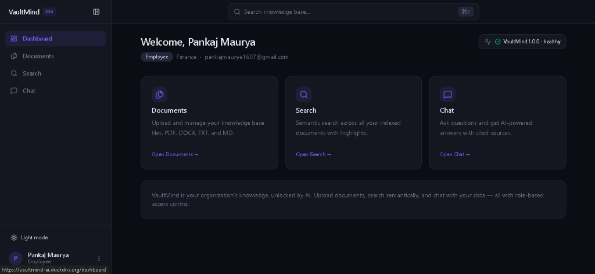

# 🧠 VaultMind
### Enterprise Knowledge Assistant & RAG Platform with Granular RBAC

A production-grade, enterprise Retrieval-Augmented Generation (RAG) platform that securely indexes organizational documents, isolates department data with strict Role-Based Access Control (RBAC), performs real-time semantic vector search using PostgreSQL + PGVector, and orchestrates asynchronous ingestion pipelines with Celery and Redis.

---

## 🌐 Live Demo
| Component | URL | Notes |
|---|---|---|
| 🧠 **Live Application** | [https://vaultmind-ai.duckdns.org](https://vaultmind-ai.duckdns.org) | Full SPA with Guest Quick-Try & Document RAG |
| 📊 **User & Admin Portal** | [https://vaultmind-ai.duckdns.org/login](https://vaultmind-ai.duckdns.org/login) | Role-scoped access (Admin, Manager, Employee) |
| ⚡ **API Health & Metrics** | [https://vaultmind-ai.duckdns.org/health](https://vaultmind-ai.duckdns.org/health) | Real-time system health check |

---

## 🚀 Overview
The project emphasizes engineering a **highly secure, enterprise-grade AI knowledge platform**, not simply a standard RAG or basic chatbot.

In large enterprise organizations, different teams (Finance, HR, Engineering, Sales, Marketing) hold sensitive documents that must **never leak across departments**. VaultMind combines an asynchronous processing pipeline with parameterized SQL-level tenant/department isolation and local BGE embeddings to produce an air-tight, low-latency intelligence assistant.

Given a query or document upload, it automatically:
- 🔒 **Enforces Granular RBAC:** Department-level query filtering baked directly into vector similarity queries at the PostgreSQL level.
- 📄 **Asynchronously Ingests Documents:** Streamed uploads (PDF, DOCX, TXT, MD) handed off to a dedicated Celery worker pool for background parsing, recursive chunking, and vector embedding.
- ⚡ **Performs Fast HNSW Vector Retrieval:** 384-dimensional cosine similarity search powered by PostgreSQL 16 + PGVector with HNSW indexing.
- 🤖 **Multi-Tier LLM Orchestration:** Google Gemini 3.1 Flash Lite integration with resilient auto-retry, exponential backoff, and graceful contextual fallback.
- ⏱️ **Zero-Friction "Quick Try" Mode:** Guest document sandbox with isolated tokenization and automatic 10-minute TTL cleanup.
- 🛡️ **Enterprise Audit Logging:** Full accountability logging every query, document upload, and authentication event with IP and timestamp metadata.

---

## ✨ Features
- **👥 Strict Role-Based Access Control (RBAC):** Admin, Manager, and Employee roles with automated department data isolation at the SQL query layer.
- **🔍 Sub-second Semantic Vector Search:** PGVector with HNSW indexing and cosine similarity over 384-dimensional FastEmbed (`BAAI/bge-small-en-v1.5`) embeddings.
- **💬 Context-Aware AI Chat:** Citations, inline references, confidence scoring, and multi-turn session persistence.
- **⚡ Async Event Processing:** Redis broker + Celery worker pool handling heavy document parsing and chunking off the critical API path.
- **⏱️ Guest Quick-Try Sandbox:** Upload up to 1MB and chat immediately without signing up, automatically pruned after a 10-minute TTL.
- **📊 Real-time System Telemetry:** Prometheus metrics for request latency, vector search speed, token consumption, and worker health.
- **🐳 Full Docker & Compose Support:** 5-service isolated stack (Postgres/PGVector, Redis, FastAPI, Celery Worker, React/Nginx proxy).

---

## 🏗️ Architecture
### Pipeline Overview
1. **Client / Browser:** React 19 SPA communicates with Nginx reverse proxy on port 80.
2. **API Gateway:** FastAPI authenticates the request via JWT cookies/Bearer headers and enforces RBAC permission scopes.
3. **Async Queue:** When a document is uploaded, FastAPI streams the file to storage and dispatches a job to Redis.
4. **Celery Worker Pool:** Workers pick up jobs from the `document_processing` queue, extract text (PDF/DOCX/TXT/MD), chunk text with semantic overlaps, compute ONNX embeddings via FastEmbed, and insert vector rows into PostgreSQL.
5. **Retrieval & Generation:** Chat queries embed the question in real-time, execute a cosine distance HNSW vector search strictly filtered by user department IDs, assemble the context, and query Gemini 3.1 Flash Lite with inline citations.

```
┌────────────────────────────────────────────────────────────────────────┐
│                              Client (Browser)                          │
└───────────────────────────────────┬────────────────────────────────────┘
                                    │ HTTP / REST (:80)
                                    ▼
┌────────────────────────────────────────────────────────────────────────┐
│                        Nginx Reverse Proxy                             │
│                  (SPA Routing + /api/v1 Proxy)                         │
└───────────────────────────────────┬────────────────────────────────────┘
                                    │
                                    ▼
┌────────────────────────────────────────────────────────────────────────┐
│                           FastAPI Backend                              │
│              (JWT Auth, RBAC Enforcer, Rate Limiting)                  │
└─────────────┬─────────────────────┬────────────────────┬───────────────┘
              │                     │                    │
              ▼                     ▼                    ▼
     ┌─────────────────┐   ┌─────────────────┐   ┌─────────────────┐
     │  Redis Queue    │   │  PostgreSQL 16  │   │  Gemini 3.1     │
     │ (Broker & Cache)│   │   + PGVector    │   │  Flash Lite     │
     └────────┬────────┘   │  (HNSW Index)   │   └─────────────────┘
              │            └────────▲────────┘
              ▼                     │
     ┌─────────────────┐            │
     │  Celery Worker  │────────────┘
     │ (Parse & Embed) │  Write Vectors
     └─────────────────┘
```

---

## 📸 Screenshots
Here is a look at the VaultMind user interface and administrative flows:

### 1. Landing Page — Enterprise Knowledge Assistant


### 2. Core Capabilities & Architectural Pillars


### 3. How It Works — Ingestion to Intelligence


### 4. Instant Guest Quick-Try Sandbox (No Signup Needed)


### 5. Employee Dashboard & Department Knowledge Hub


---

## 📂 Project Structure
```
VaultMind/
├── backend/
│   ├── alembic/                 # Alembic database migrations
│   ├── app/
│   │   ├── api/                 # FastAPI route controllers (Auth, Chat, Docs, Admin, Guest)
│   │   ├── auth/                # JWT tokens, password hashing, cookies
│   │   ├── config/              # Pydantic BaseSettings & environment configs
│   │   ├── db/                  # Async SQLAlchemy 2.0 engine & session lifecycle
│   │   ├── mid/                 # Rate limiting, CSRF protection, request logging
│   │   ├── models/              # SQLAlchemy ORM models (PGVector vector columns)
│   │   ├── monitoring/          # Prometheus metrics & performance instrumentation
│   │   ├── rag/                 # FastEmbed embeddings, HNSW Retriever, Gemini Generator
│   │   ├── rbac/                # Department scoping & permission dependencies
│   │   ├── repositories/        # Database repository layer
│   │   ├── schemas/             # Pydantic validation schemas
│   │   ├── services/            # Business logic (Auth, Chat, Document, Guest, Audit)
│   │   ├── tasks/               # Celery async tasks for file parsing and embedding
│   │   └── workers/             # Celery app initialization
│   ├── Dockerfile               # Production API image
│   ├── Dockerfile.worker        # Dedicated Celery worker image
│   ├── requirements.txt         # Python dependencies
│   └── seed_data.py             # Idempotent DB seeder
├── frontend/
│   ├── src/
│   │   ├── components/          # Reusable UI components & layouts (Sidebar, CommandBar)
│   │   ├── context/             # AuthContext, ThemeContext (Dark/Light mode)
│   │   ├── hooks/               # Custom React Query & API mutation hooks
│   │   ├── pages/               # Landing, QuickTry, Chat, Documents, Admin dashboards
│   │   ├── types/               # TypeScript interfaces
│   │   └── App.tsx              # Router & layout entrypoint
│   ├── Dockerfile               # Multi-stage production build
│   ├── nginx.conf               # Reverse proxy & SPA fallback configuration
│   └── package.json             # Frontend dependencies (React 19, Tailwind CSS, Vite)
├── docs/
│   └── screenshots/             # High-resolution application screenshots
├── docker-compose.yml           # Multi-container orchestration (5 isolated services)
├── .env.example                 # Environment configuration template
└── README.md                    # Project documentation
```

---

## 🛠️ Tech Stack
| Layer | Technology |
|---|---|
| **Language & Backend** | Python 3.12, FastAPI, Uvicorn |
| **Frontend** | React 19, TypeScript, Vite, Tailwind CSS |
| **Database & Vector Store** | PostgreSQL 16 + PGVector (384-dim HNSW Index) |
| **Cache & Message Broker** | Redis 7, Celery 5.4 |
| **AI & Embeddings** | FastEmbed (`bge-small-en-v1.5`), Google Gemini 3.1 Flash Lite |
| **Infrastructure & Proxy** | Docker, Docker Compose, Nginx |

---

## ⚙️ Local Setup

### 1. Clone the repository
```bash
git clone https://github.com/pankajmaurya1607/VaultMind.git
cd VaultMind
```

### 2. Configure Environment Variables
Copy the template and set your keys:
```bash
cp .env.example .env
```
Set your `SECRET_KEY` and `GEMINI_API_KEY` in `.env`:
```env
SECRET_KEY=your-secure-random-secret-key
ENVIRONMENT=development
GEMINI_API_KEY=your-gemini-api-key
GEMINI_CHAT_MODEL=gemini-3.1-flash-lite
```

### 3. Run the Backend Infrastructure (Docker)
The easiest way to start all services, database, Celery workers, and Nginx proxy is via Docker Compose:
```bash
docker compose up -d --build
```
Wait a few seconds for PostgreSQL and Redis to properly initialize.

- **Web Application (UI):** [http://localhost](http://localhost)
- **API Documentation (Swagger):** [http://localhost:8000/docs](http://localhost:8000/docs)
- **Authentication:** Sign in using organizational credentials or register through the portal.

### 4. Run the Frontend (Local Dev Mode - Optional)
If you wish to run the Vite dev server with Hot Module Replacement (HMR):
```bash
cd frontend
npm install
npm run dev
```
Navigate to `http://localhost:5173` in your browser.

---

## 🤝 Contributing
VaultMind is an open-source personal project designed to showcase scalable, enterprise-grade AI architecture. Feel free to:
- ⭐ Star the repository
- 🍴 Fork it
- 🛠️ Build on top of it
- 💡 Share feedback or ideas

---

## 📄 License
This project is licensed under the [MIT License](LICENSE).
